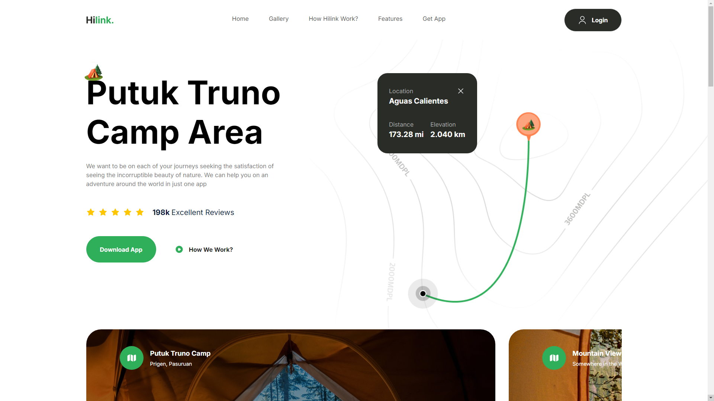

# Travel App



## Table of Contents

- [Introduction](#introduction)
- [Features](#features)
- [Installation](#installation)
- [Usage](#usage)
- [Contributing](#contributing)
- [License](#license)
- [Contact](#contact)

## Introduction

The Travel App is a UI/UX web application built using Next.js and Tailwind. It showcases an app called **Hilink**, designed to help users navigate even the most challenging trails with ease. Hilink is available for both Android and iOS, providing seamless navigation for adventurers and hikers.

## Features

- User-friendly navigation interface
- Easy access to difficult trails
- Available on Android and iOS platforms

## Installation

To set up the project locally, follow these steps:

1. **Clone the repository:**

    ```bash
    git clone https://github.com/Hacker-Anakin/Travel-App.git
    ```

2. **Navigate to the project directory:**

    ```bash
    cd Travel-App
    ```

3. **Install the dependencies:**

    ```bash
    npm install
    ```

## Usage

To start the development server, run:

```bash
npm start
```

Open [http://localhost:3000](http://localhost:3000) in your browser to view and interact with the Travel App.

## Contributing

We welcome contributions to improve the Travel App. To contribute:

1. Fork the repository.
2. Create a new branch (`git checkout -b feature/your-feature`).
3. Commit your changes (`git commit -m 'Add your feature'`).
4. Push to the branch (`git push origin feature/your-feature`).
5. Open a Pull Request.

## License

This project is licensed under the MIT License. See the [LICENSE](LICENSE) file for details.

## Contact

For any questions or feedback, please contact us at [cakely63@gmail.com](mailto:cakely63@gmail.com).

---

Let me know if you'd like any further changes or additional details!
